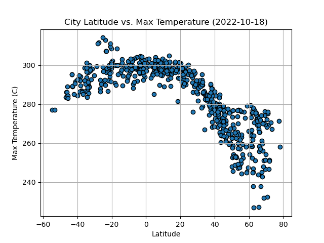
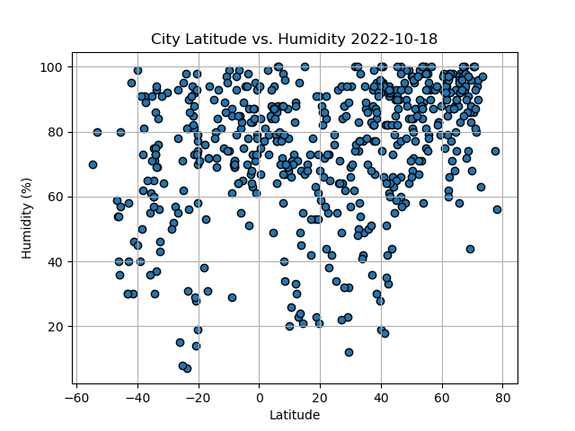
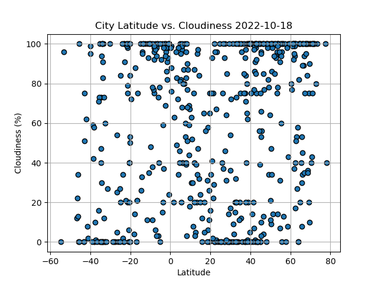
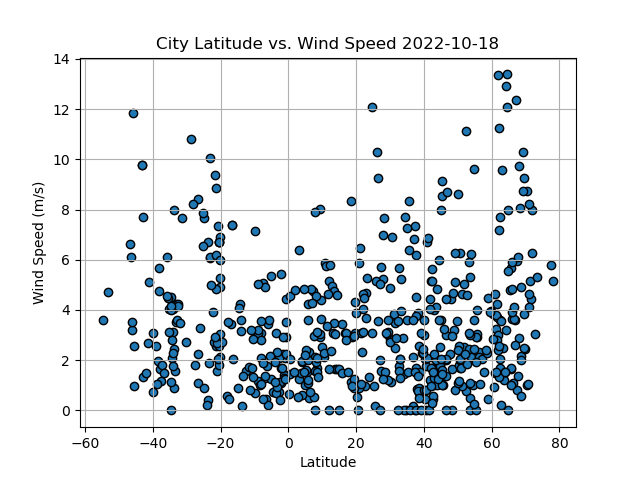

# Python API Challenge

## Introduction

Welcome to the Python API Challenge repository! In this project, we explore and analyze weather data from over 500 cities worldwide to understand the relationship between various weather variables and their proximity to the equator.

## Project Description

Data's true power is its ability to definitively answer questions. So, let's take what you've learned about Python requests, APIs, and JSON traversals to answer a fundamental question: "What is the weather like as we approach the equator?"

We started by creating a Python script to visualize the weather of these cities. We used the citipy Python library, the OpenWeatherMap API, and various Python coding skills to develop a solution to address the required functionalities.

### Part 1: WeatherPy
- We retrieved weather data from the OpenWeatherMap API for over 500 cities.
- We created scatter plots to showcase the relationships between latitude and:
  - Temperature
  - Humidity
  - Cloudiness
  - Wind Speed
- We computed linear regression for each relationship, separating the plots into Northern and Southern Hemispheres.
- We included the linear regression line, the model's formula, and the r-values for analysis.

### Part 2: VacationPy
- We used the Geoapify API and geoViews Python library to plan future vacations based on weather data.
- We created a map that displayed cities with humidity as the size of the point.
- We narrowed down cities based on weather conditions, such as temperature, wind speed, and cloudiness.
- We found hotels near selected cities using the Geoapify API and displayed them on the map.

## File Structure

- `WeatherPy.ipynb`: Jupyter notebook for Part 1 of the project, which includes weather data retrieval, scatter plots, and linear regression.
- `VacationPy.ipynb`: Jupyter notebook for Part 2 of the project, which includes vacation planning using weather data and hotel mapping.
- `api_keys.py`: Placeholder for your API keys (remember not to share this on GitHub).
- `.gitignore`: Excludes sensitive files from version control.
- `README.md`: You are here.

## Getting Started

1. Clone this repository to your local machine.
2. Make sure you have Python installed, along with the necessary libraries mentioned in the Jupyter notebooks.
3. Obtain API keys for OpenWeatherMap and Geoapify, and store them in `api_keys.py`.
4. Follow the instructions provided in the Jupyter notebooks to run the code.

## Usage

Detailed usage instructions for running the code are provided within the Jupyter notebooks `WeatherPy.ipynb` and `VacationPy.ipynb`.

## Results

The results of this project include:
- Scatter plots showcasing the relationship between the maximum temperature and latitude.
  
- Scatter plots showcasing the relationship between humidity and latitude.
 
- Scatter plots showcasing the relationship between cloudiness and latitude.
  
- Scatter plots showcasing the relationship between wind speed and latitude.
  
- A map displaying cities with humidity as the size of the point, narrowed down based on weather conditions.
- Hotel information for selected cities on the map.
